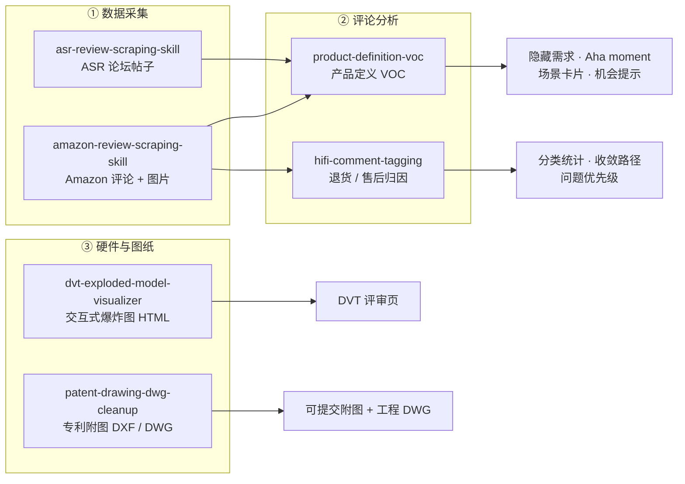

<div align="center">

# Work Skill

**一套面向产品研究的 Agent 技能集 —— 从抓评论、做归因，到出硬件爆炸图和专利附图**

[](#技能包一览)
[](#2-安装)
[](#2-安装)
[](#1-环境要求)
[](#1-环境要求)

[快速开始](#快速开始) · [技能包一览](#技能包一览) · [推荐工作流](#推荐工作流) · [目录结构](#目录结构) · [常见问题](#常见问题)

</div>

---

## 这是什么

把产品研究里反复要做的几件事，固化成 Agent 可以直接执行的技能包：搜竞品、抓评论、清洗打标、写 VOC 结论、出硬件透视爆炸图、把 CAD 模型变成能提交的专利附图。

每款技能都是一个独立目录，包含给 Agent 读的规则（`SKILL.md`）、可复用的执行脚本（`scripts/`）和输入输出契约（`references/`）。Agent 读规则、调脚本，你拿到的是可复核的 Excel、HTML 或 DXF/DWG，而不是一段没有出处的结论文字。



### 设计原则

- **先确认范围，再动手采集** —— 抓取类技能一律先出预检结果，你回复确认后才真正执行。
- **保留证据链** —— 每条结论都能追回源文件、sheet、行号和图片。
- **交付可复核的文件** —— 以 Excel、HTML、DXF 为主，不是只给一段结论。
- **复用既有标签体系** —— 不临时发明近义标签，避免同一件事出现三种叫法。

---

## 快速开始

### 1. 环境要求

| 依赖 | 是否必需 | 用途 | 检查命令 |
| --- | :---: | --- | --- |
| Claude Code 或 Codex | ✅ | 加载并运行技能 | `claude --version` |
| Git | ✅ | 克隆本仓库 | `git --version` |
| Python 3.9+ | ✅ | 绝大多数脚本（已在 3.9.6 上验证） | `python3 --version` |
| `ezdxf` | 专利附图技能必需 | 读写 DXF | `python3 -c "import ezdxf"` |
| `numpy` | 专利附图技能必需 | 几何计算 | `python3 -c "import numpy"` |
| Node.js 18+ 与 npm | 抓取类技能必需 | Playwright 浏览器自动化 | `node --version && npm --version` |
| `cadquery-ocp` | 仅「从 3D CAD 生成附图」必需 | OpenCASCADE 内核，**下载约数百 MB** | `python3 -c "import OCP"` |
| LibreDWG | 无 AutoCAD 时转 DWG 必需 | `brew install libredwg` | `dwgwrite --version` |
| AutoCAD | 可选 | 转 DWG 的首选引擎 | — |

一次装齐 Python 侧的必需依赖：

```bash
python3 -m pip install ezdxf numpy
```

> `claude --version` 若报 `command not found`，说明 Claude Code 不在 PATH 里，或 shell 配置有问题。这不影响下面的安装步骤——技能安装只是复制文件，装完后在 Claude Code 界面里验证即可。

### 2. 安装

技能的安装方式就是把目录放到 Agent 的技能搜索路径下。三选一。

<details open>
<summary><strong>方式一：全部安装（推荐）</strong></summary>

```bash
git clone https://github.com/janauto/work_skill.git
cd work_skill
mkdir -p ~/.claude/skills
for d in amazon-review-scraping-skill asr-review-scraping-skill hifi-comment-tagging \
         dvt-exploded-model-visualizer patent-drawing-dwg-cleanup product-definition-voc; do
  cp -R "$d" ~/.claude/skills/
done
```

除 `git clone` 的进度信息外没有其他输出。是否装好，以下一节「验证安装」的逐项检查为准。

`cp -R` 是覆盖式合并，不会清理旧文件。重装时若担心残留，先删掉 `~/.claude/skills/<技能名>` 再复制。

> 执行完这一段后，你的当前目录停在克隆出来的 `work_skill/` 里。下面所有相对路径命令都以此为起点。

</details>

<details>
<summary><strong>方式二：只装其中一款</strong></summary>

```bash
git clone https://github.com/janauto/work_skill.git
cd work_skill
mkdir -p ~/.claude/skills
cp -R patent-drawing-dwg-cleanup ~/.claude/skills/
```

把 `patent-drawing-dwg-cleanup` 换成你要的目录名即可。

</details>

<details>
<summary><strong>方式三：用打包好的 .skill 文件</strong></summary>

`.skill` 是 zip 包，解压后即为标准技能目录。该文件在仓库根目录，所以同样要先克隆：

```bash
git clone https://github.com/janauto/work_skill.git
cd work_skill
mkdir -p ~/.claude/skills
unzip -o product-definition-voc.skill -d ~/.claude/skills/
```

</details>

<details>
<summary><strong>只在单个项目里生效</strong></summary>

把目录复制到项目根目录的 `.claude/skills/` 下，作用范围仅限该项目：

```bash
mkdir -p .claude/skills && cp -R /path/to/work_skill/product-definition-voc .claude/skills/
```

</details>

> Codex 用户：各技能目录下的 `agents/openai.yaml` 提供了 Codex 侧的展示名与默认提示词，安装路径以你的 Codex 配置为准。

### 3. 验证安装

先确认 6 款技能都到位：

```bash
for d in amazon-review-scraping-skill asr-review-scraping-skill hifi-comment-tagging \
         dvt-exploded-model-visualizer patent-drawing-dwg-cleanup product-definition-voc; do
  [ -f ~/.claude/skills/$d/SKILL.md ] && echo "ok   $d" || echo "缺失 $d"
done
```

预期输出 6 行、全部以 `ok` 开头。出现 `缺失` 说明对应目录没复制成功，重跑上一步即可。

再确认脚本可运行：

```bash
python3 ~/.claude/skills/patent-drawing-dwg-cleanup/scripts/validate_clean_dxf.py --help
```

预期输出以 `usage: validate_clean_dxf.py` 开头的用法说明。若提示 `ModuleNotFoundError: No module named 'ezdxf'`，执行 `python3 -m pip install ezdxf` 后重试。

以上两步是可脚本化的验收条件。最后一步需要人工确认：在 Claude Code 里新开一轮对话，输入一句能命中技能的话，例如「帮我清理这批专利附图，转成实线 DXF」。Agent 应当主动加载 `patent-drawing-dwg-cleanup` 并按其规则回应；如果它完全没提到这款技能，多半是目录放错了位置。

<!-- For AI agents: non-interactive install and smoke test. Re-runnable: uses an absolute
clone path and never depends on the current working directory.
REPO="${REPO:-$HOME/work_skill}"
[ -d "$REPO/.git" ] || git clone https://github.com/janauto/work_skill.git "$REPO"
mkdir -p ~/.claude/skills && cp -R "$REPO/patent-drawing-dwg-cleanup" ~/.claude/skills/ && python3 -m pip install ezdxf numpy && python3 ~/.claude/skills/patent-drawing-dwg-cleanup/scripts/validate_clean_dxf.py --help
Expected: usage text starting with "usage: validate_clean_dxf.py". No credentials required.
Node.js is only needed for the two scraping skills; cadquery-ocp only for STEP-to-drawing. -->

---

## 技能包一览

| 技能包 | 解决什么问题 | 主要产出 |
| --- | --- | --- |
| [`amazon-review-scraping-skill`](#1-amazon-review-scraping-skill) | 按关键词圈定竞品范围，预检后抓评论和评论图 | 多商品评论 Excel、评论图片 |
| [`asr-review-scraping-skill`](#2-asr-review-scraping-skill) | 采集 Audio Science Review 论坛的音频产品讨论 | 打标准备 Excel、附件原图 |
| [`hifi-comment-tagging`](#3-hifi-comment-tagging) | 单产品的评论、退货、售后归因 | 清洗表、打标表、总结表 |
| [`product-definition-voc`](#4-product-definition-voc) | 从评论里提炼产品定义所需的洞察 | 需求聚类、Aha moment、场景卡片 |
| [`dvt-exploded-model-visualizer`](#5-dvt-exploded-model-visualizer) | 把整机 CAD 变成可交互的透视爆炸评审页 | 可交互 HTML、GLB、元数据 |
| [`patent-drawing-dwg-cleanup`](#6-patent-drawing-dwg-cleanup) | 生成或清理专利附图，交付可编辑 DXF/DWG | 全实线 DXF、已审计 DWG |

### 快速选择

| 你要做的事 | 用哪款 |
| --- | --- |
| 抓 Amazon 商品评论和评论图片 | `amazon-review-scraping-skill` |
| 先按关键词找竞品范围，确认后再抓 | `amazon-review-scraping-skill` |
| 抓 ASR 论坛帖子，整理音频用户讨论 | `asr-review-scraping-skill` |
| 分析单个 HIFI 产品的退货和售后问题 | `hifi-comment-tagging` |
| 从评论里找隐藏需求和 Aha moment | `product-definition-voc` |
| 给硬件团队出一版可交互爆炸图评审页 | `dvt-exploded-model-visualizer` |
| 从 STEP 模型生成专利附图 | `patent-drawing-dwg-cleanup` |
| 把已有 DWG/DXF 附图去编号、转实线 | `patent-drawing-dwg-cleanup` |

---

## 技能包详解

### 1. Amazon Review Scraping Skill

路径：`amazon-review-scraping-skill/`

按 2–3 个关键词搜索 Amazon 商品，先给出候选范围和评论规模估算，你确认后再真正抓取。适合竞品研究和评论 VOC 收集。

**核心能力**

- 支持 `amazon.sg`、`amazon.com` 等站点。
- 根据关键词生成候选商品和编号场景草稿。
- 正式抓取前输出预检结果：候选商品数、评论规模估算、Top N 预览。
- 支持用 `不搜索：1、8、11` 排除不需要的场景。
- 只有明确回复 `开始执行` 才进入真实抓取。
- 用 Playwright 持久化会话，可人工登录后复用登录状态。
- 抓取 top、recent、positive、critical 等多种评论视图。
- 下载评论图片、去重评论、生成多商品 Excel。
- 内置普通页面与 stealth 反爬页面两套抓取脚本。

**安装依赖**

```bash
cd amazon-review-scraping-skill
npm install
npx playwright install chromium
python3 -m pip install openpyxl pillow requests
```

**预检并等待确认**

```bash
node scripts/amazon-preflight-workflow.js \
  --marketplace amazon.sg \
  --keywords "rca switcher,3.5mm switcher,audio selector" \
  --category Electronics \
  --price-min 10 --price-max 60 --min-rating 4.0 --top-n 5 \
  --output-dir "./output"
```

**排除部分场景**

```bash
node scripts/amazon-preflight-workflow.js \
  --state "./output/preflight_state.json" --reply "不搜索：1、8、11"
```

**确认执行**

```bash
node scripts/amazon-preflight-workflow.js \
  --state "./output/preflight_state.json" --reply "开始执行"
```

**其他网页抓取**

```bash
node scripts/playwright-simple.js "https://example.com"                      # 普通动态页
HEADLESS=false SAVE_HTML=true node scripts/playwright-stealth.js "https://example.com"   # 强反爬页
```

**主要输出**：`preflight_state.json`、抓取 manifest、单商品评论 JSON、评论图片目录、多商品评论 Excel（含场景、候选商品、评论明细、抓取汇总）。

### 2. ASR Review Scraping Skill

路径：`asr-review-scraping-skill/`

采集 Audio Science Review 论坛帖子，生成可直接打标的 Excel。适合研究 DAC、前级、切换器、AVR、功放的真实用户讨论。

**核心能力**

- 提取帖子正文、作者、时间、链接等元数据。
- 用 `r.jina.ai` 文本镜像读取论坛正文。
- 从本地 Chrome 缓存恢复附件原图，避免只留低质量截图。
- 可生成中文翻译列和标签列。
- 输出单 sheet Excel，便于人工或半自动打标。
- 内置 simple 与 stealth 两套 Playwright 脚本，也可用于其他网页。

**安装依赖**

```bash
cd asr-review-scraping-skill
npm install
npx playwright install chromium
python3 -m pip install -r requirements.txt
```

**运行**

```bash
python3 scripts/run_asr_pipeline.py --dataset-root runs/default        # 完整流程
python3 scripts/fetch_asr_threads.py --dataset-root runs/default       # 只抓线程
python3 scripts/build_asr_workbook.py --dataset-root runs/default      # 只重建 Excel
```

用自定义 URL 列表：

```bash
python3 scripts/run_asr_pipeline.py \
  --dataset-root runs/project-a \
  --urls-file /abs/path/curated_threads.txt
```

**主要输出**：`raw_threads/`、`thread_index.json`、`thread_summary.md`、`downloaded_images/`、`preview_images/`、`translation_cache.json`、打标准备 Excel。

**关于翻译**：若环境变量中存在 `ZHIPUAI_API_KEY`、`ZHIPU_API_KEY` 或 `BIGMODEL_API_KEY`，脚本会调用智谱 API 生成中文翻译；没有 key 时复用已有缓存，未命中的翻译列留空，流程不中断。

### 3. HIFI Comment Tagging

路径：`hifi-comment-tagging/`

针对单个 HIFI 产品，把评论、退货原因、售后反馈清洗成可归因的标签体系。

**核心能力**

- 读取 Excel，自动识别候选 sheet、表头和产品信号。
- 聚焦单个目标产品，例如 `P4`、`ZD3`、`ZA3`、`ZP3`、`LC30`、`MC331`。
- 清洗空评论、无效文本、重复评论和无实质内容的退货原因。
- 保留原始文件、sheet、行号等来源信息。
- 使用 1–4 级中文分类链打标。
- 可从历史人工标注表中提取可复用的标签和示例。

**主要输出**

- `CleanedComments` —— 聚焦目标产品后的标准化有效反馈。
- `TaggedComments` —— 带完整分类链的评论明细。
- `Summary` —— 分类统计、收敛路径、关键问题、趋势和产品经理视角的总结。

**使用约定**

- 每次默认只分析一个产品；源文件含多个产品时，必须先指定目标。
- 退货分析中，买家备注为空默认不计入有效反馈，但仍保留在审计信息里。

### 4. Product Definition VOC

路径：`product-definition-voc/`

面向产品定义的 VOC 分析：用户到底喜欢什么、为什么流失、有哪些没说出口的需求。

**核心能力**

- 针对一个产品、品类、场景或竞品集合做 VOC 分析。
- 清洗重复、无效、物流、卖家服务、优惠券、跑题等评论。
- 保留原始评论、翻译、评分、图片引用、商品链接和来源行号。
- 使用面向产品定义的标签体系归因。
- 输出隐藏需求、Aha moment、情绪热区、场景卡片和机会提示。

**主要输出**：`CleanedComments`、`TaggedComments`、`NeedClusters`、`AhaMoments`、`EmotionMap`、`SceneCards`、`Summary`。

**能回答的问题**：用户明确喜欢什么；为什么犹豫、流失或停用；隐藏需求及其占比；Aha moment 的原始证据；不同功能和场景下的情绪热区；可转化为产品定义的机会提示。

### 5. DVT Exploded Model Visualizer

路径：`dvt-exploded-model-visualizer/`

把整机 CAD 变成可交互的透视爆炸评审页，并能把提议的局部改动与源 CAD 分开标识。

**核心能力**

- 扫描输入文件，识别 STEP/STP、GLB/GLTF、2D 图、BOM、需求文档和占位文件。
- 生成爆炸距离、透视、标准视图、模块显隐、点选查看等交互。
- 把源 CAD、`PROPOSED DVT`、`CONCEPT ONLY` 分开标识，避免把概念件当成已冻结 CAD。
- 用真实可制造的截面表达平板环、导光件、遮光支架、FPC 尾线、安装耳、螺钉柱和紧固方向。
- 在页面中加入「开始前请放入这些文件」提醒、BOM、装配步骤、工艺步骤和 DVT 检验关卡。
- 用真实浏览器回归验证模型加载、交互、桌面与移动布局及控制台报错。

**主要输出**：可交互 HTML 透视爆炸图、派生的 GLB 与元数据、装配/爆炸预览图、局部修改方案与待补文件清单。

### 6. Patent Drawing DWG Cleanup

路径：`patent-drawing-dwg-cleanup/`

两件事：**从 3D 模型生成**专利附图，或**清理已有**附图。前者是新增的最高保真路径。

> **本节所有命令都在 `work_skill/patent-drawing-dwg-cleanup/` 目录下执行。** 先进入该目录，之后不要再切换：
>
> ```bash
> cd patent-drawing-dwg-cleanup     # 从 work_skill/ 进入；已在其中则跳过
> ```
>
> 安装到 `~/.claude/skills/` 的那份是给 Agent 读的，与克隆目录内容相同。装完后请保留克隆目录，脚本从这里跑。

**从 3D CAD 生成（推荐）**

直接对 STEP 装配做解析消隐（OpenCASCADE `HLRBRep`，与 AutoCAD FLATSHOT、Rhino Make2D 同一类算法），不描图、不反推位图：

```bash
python3 -m pip install cadquery-ocp ezdxf numpy  # cadquery-ocp 约数百 MB，请预留时间

python3 scripts/cad_hlr_to_dxf.py assembly.step --list-parts    # 只打印零件清单到屏幕，不写文件
python3 scripts/cad_hlr_to_dxf.py assembly.step figure.dxf \
  --view iso --explode-axis z --table --caption "图1"
```

要点写在 [`references/cad-source-to-drawing.md`](patent-drawing-dwg-cleanup/references/cad-source-to-drawing.md)，其中两个坑最容易毁掉整条链路：漏取光滑曲面的轮廓线会让注塑壳体轮廓断开；画出相切接缝会让壳体看起来像多面体。

**清理已有附图**

```bash
python3 scripts/clean_patent_dxf.py input.dxf cleaned.dxf \
  --reference-number 100 --reference-number 310 \
  --strip-selected-inline-references --remove-figure-labels \
  --report cleanup-report.json
```

- 删除前先盘点数字文本，区分专利附图标记与 `A1`、`24V`、尺寸、公差等有效工程信息。
- 把图元和图层线型统一为 `CONTINUOUS`，而不是只在预览里看着像实线。
- 支持从 Matplotlib artist 导出 LINE、POLYLINE、CIRCLE、箭头和文字。

**转 DWG 并校验**

上一步的输出 `cleaned.dxf` 就是下面三条命令的输入：

```bash
python3 scripts/validate_clean_dxf.py cleaned.dxf                        # 结构校验
python3 scripts/autocad_core_dxf_to_dwg.py cleaned.dxf cleaned.dwg       # 有 AutoCAD
python3 scripts/libredwg_dxf_to_dwg.py cleaned.dxf -o dwg/ --deep-audit  # 没有 AutoCAD
```

AutoCAD 路径会跑两次 `AUDIT`，并规避 macOS 命令脚本对中文输出路径的乱码问题；LibreDWG 路径用 `dwgread` 回读顶替 AUDIT。中文文字同时交付「可编辑文字 DXF」与「字体无关的矢量文字 DWG」两版。

---

## 推荐工作流

### 竞品评论研究


1. 用 `amazon-review-scraping-skill` 按关键词生成候选商品。
2. 在预检结果里排除无关场景。
3. 回复 `开始执行`，抓取评论和图片。
4. 把导出的评论 Excel 交给 `product-definition-voc`。
5. 得到隐藏需求、Aha moment、场景卡片和产品机会。

### HIFI 售后与退货归因

1. 准备目标产品的评论、退货或售后 Excel。
2. 用 `hifi-comment-tagging` 先做 workbook profile。
3. 聚焦单个产品，清洗出有效反馈。
4. 复用历史人工标签，或按标准分类链打标。
5. 生成总结表，用于产品复盘和问题优先级排序。

### 音频论坛洞察

1. 收集 ASR 相关 thread URL。
2. 写入 `asr-review-scraping-skill/runs/<project>/curated_threads.txt`。
3. 运行 ASR pipeline。
4. 得到帖子、附件原图和打标准备表。
5. 结合 `product-definition-voc` 或人工标签体系继续分析。

### 从 CAD 到专利附图

1. 导出整机 STEP。
2. 用 `--list-parts` 看清装配里有哪些零件。
3. 选定零件、视角和爆炸轴，生成 DXF。
4. 跑 `validate_clean_dxf.py` 确认全实线、无非连续图层。
5. 转 DWG 并回读校验，交付「可编辑」与「文字转轮廓」两版。

---

## 目录结构

```text
work_skill/
├── amazon-review-scraping-skill/     # ✅ 可加载
│   ├── SKILL.md                      #    给 Agent 读的规则
│   ├── README.md
│   ├── package.json
│   ├── references/                   #    输入契约、标签体系、输出布局
│   └── scripts/                      #    实际执行入口
├── asr-review-scraping-skill/        # ✅ 可加载
├── hifi-comment-tagging/             # ✅ 可加载
├── dvt-exploded-model-visualizer/    # ✅ 可加载
├── patent-drawing-dwg-cleanup/       # ✅ 可加载
├── product-definition-voc/           # ✅ 可加载
├── product-definition-voc.skill      #    打包版（zip）
├── competitive-analysis-skill/       # ⚠️ 见下方说明
└── thesis-editing-skill/             # ⚠️ 见下方说明
```

标准技能目录的结构：

```text
new-skill/
├── SKILL.md          # 必需：frontmatter 里的 name 与 description 决定技能何时被触发
├── README.md         # 可选：给人看的说明
├── agents/           # 可选：Codex 等其他 Agent 平台的接口描述
├── references/       # 输入契约、标签体系、输出布局、总结模板
└── scripts/          # 可复用的执行脚本
```

### 两个尚未标准化的目录

`competitive-analysis-skill/` 和 `thesis-editing-skill/` 里有可用的内容，但**没有 `SKILL.md`**，因此按上面的安装步骤复制过去不会被 Agent 自动加载：

- `competitive-analysis-skill/` 用的是 `competitive-analysis.skill.md` 和 `hardware-analysis.skill.md` 两个文件名。
- `thesis-editing-skill/` 用的是 `AGENT.md` 加若干独立 Python 脚本。

想用的话，目前需要手工把规则文件改名为 `SKILL.md` 并补上 frontmatter。

---

## 常见问题

**Agent 没有加载技能怎么办**
先确认 `~/.claude/skills/<技能名>/SKILL.md` 确实存在。技能是靠 `SKILL.md` frontmatter 里的 `description` 来匹配任务的，所以提问要贴近该描述覆盖的场景。改完技能文件后需要新开一轮对话。

**`ModuleNotFoundError` / `Cannot find module`**
各技能的依赖是分开的，装在自己目录下。按对应章节里的安装命令补装即可；抓取类技能还要执行 `npx playwright install chromium`。

**抓取脚本被 Cloudflare 拦住**
改用 stealth 脚本，并关掉无头模式：`HEADLESS=false node scripts/playwright-stealth.js "<url>"`。首次可人工登录，会话会被持久化复用。

**没有 AutoCAD 还能转 DWG 吗**
可以。用 `libredwg_dxf_to_dwg.py`，需要先 `brew install libredwg`。它只写 R2000，且不适合体量很大的合并图纸——遇到这种情况按单张图转，合并总图交付 DXF。

---

## 维护与许可

- 每款技能的**权威规则以各自目录下的 `SKILL.md` 为准**，本文件只做索引。
- `references/` 存放输入契约、标签体系、输出布局和总结模板，请勿随意删除。
- `scripts/` 是主要执行入口，优先复用脚本，不要手工改 Excel。
- 新增技能请沿用上面的标准结构，并补一份 `agents/openai.yaml` 以便 Codex 侧使用。

许可：`amazon-review-scraping-skill` 与 `asr-review-scraping-skill` 的 `package.json` 标注为 MIT，仓库根目录尚未放置统一的 LICENSE 文件。若后续引入第三方数据、模型输出或平台采集结果，请按实际来源补充更细的许可与合规说明。

<div align="center">

[⬆ 回到顶部](#work-skill)

</div>
