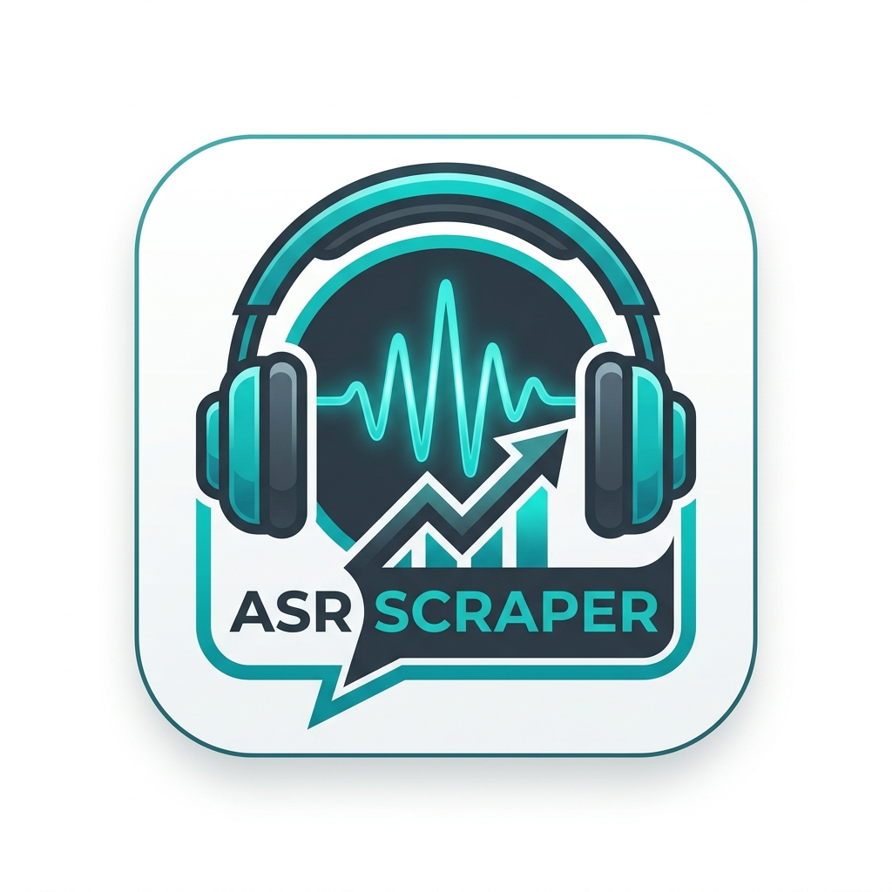

# ASR 论坛数据抓取与转制 Skill (Audio Science Review)

<div align="center">
  
</div>

本 Skill 用于抓取并在本地缓存处理 Audio Science Review (ASR) 论坛的讨论帖，提取含有讨论价值的用户插页附图，辅助翻译机器接口转换为高度定制化、便于查看汇总的独立工作簿形式。

## 🌟 核心能力与适用场景

当您需要进行以下操作时，请使用本 Skill：
- 从 Audio Science Review (ASR) 的相关讨论节点（如关于数字解码 DAC、耳放、音频前后级等主题）抓取指定的帖子和相关讨论。
- 收集包含讨论观点的配图和附件，并确保能通过缩略版的形式插入内联到 Excel 文件中。
- 生成包含：主题分类标签、多端机翻列（如 Zhipu 等）以及发帖基础元数据的单表结构工作薄。
- 对普通的动态 JS 渲染网页或具有强力反爬措施（如 Cloudflare等）的域进行无感知通用抓取。

## 🚀 主要包含脚本工具

### 1. 通用 Playwright 抓取模式
- `scripts/playwright-simple.js`：轻量版获取基础页面内容。
- `scripts/playwright-stealth.js`：突破基础防爬体系、高模拟度指纹抓取。

### 2. ASR 专向论坛作业流
- **构建工作全流** (`run_asr_pipeline.py`)：此文件串联 ASR 分析及翻译下载流程。从 `curated_threads.txt` 中读取待抓取地址并生成归档。
- **纯抓取步骤** (`fetch_asr_threads.py`)：只进行对应站点的镜像拉取与 JSON 落位存储。
- **重构可视化报表** (`build_asr_workbook.py`)：针对已缓存内容重试进行独立打标聚合 Excel 化及相关翻译翻译填补。

## 💡 安装须知

请首先确保环境库正常。在本地当前路径执行：
```bash
# Node
npm install
npx playwright install chromium

# Python 端
python3 -m pip install -r requirements.txt
```
> **注意关于图片的缓存前提：** ASR 附件图片将会尝试从计算机原端 Chrome 缓存中进行逆向寻回，因此若要求含图完整无损，操作设备的本机 Chrome 目前需要已有权限浏览过该 ASR 帖子或可直接加载其地址。 

## 🌐 关于机器翻译接口配置
如果您在系统环境内或本地设置了 `ZHIPUAI_API_KEY`，`ZHIPU_API_KEY` 或 `BIGMODEL_API_KEY` 变量，生成器会在建表时自动调用智谱大模型对文本进行本地化翻译；如果暂无此 Key 值配置，会使用之前已有的 `translation_cache.json` 覆盖，遇到无可覆盖的新文本将会留作空白处理。
